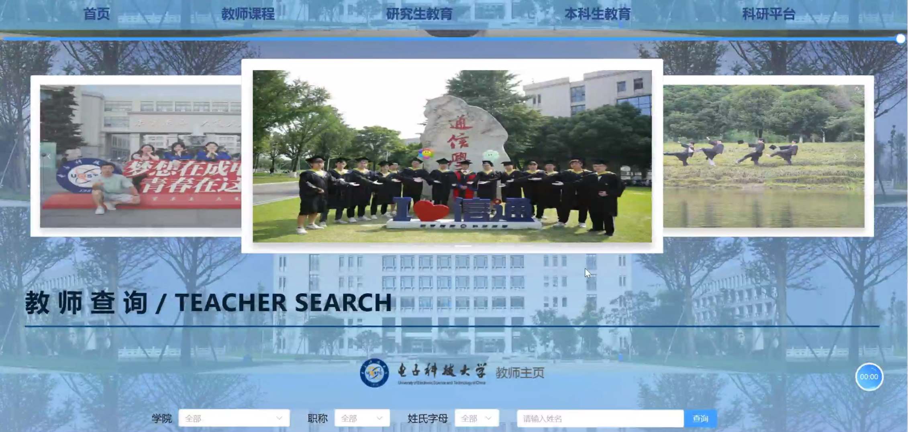
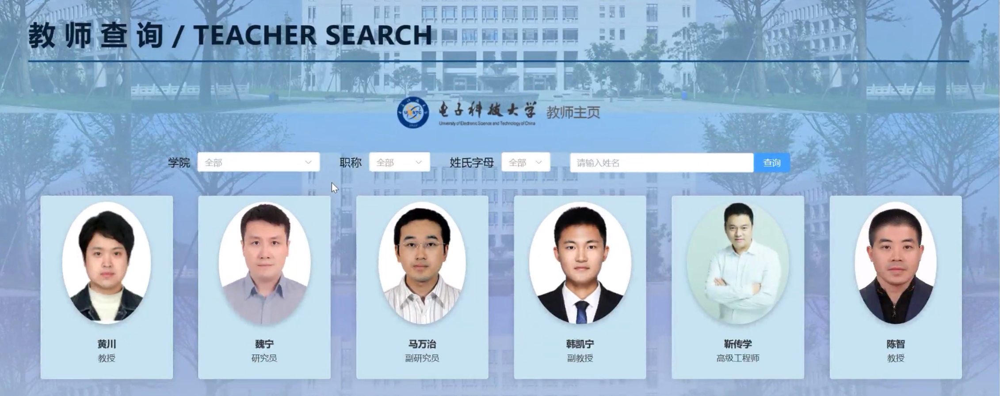

# UESTC_tearchers_query

我们选择电子科技大学的教师主页作为信息源，通过前后端分离的方式制作网站，为用户提供教师信息查询服务。
项目以vue.js语言vite项目为框架，结合 Axios 发送 API 请求，SCSS 进行样式设计。CORSMiddleware用于处理前后端分离时的跨域请求问题。

## Preview
首页展示


查询界面


## Usage
1. 使用vscode打开项目文件夹，事先安装好所需的库pandas,fastapi，elementplus（尤其出现ModuleNotFoundError时考虑是未安装库或是库版本的问题）。
```sh
npm install
```
生成配置文件，出现added xxx packages表示生成成功。

2. 运行main.py文件，显示接口ok

3. 运行
```sh
npm run dev
```
然后打开localhost链接即可

如果仍然不行，请查看或尝试以下操作
- Recommended IDE Setup
[VSCode] + [Volar]

- Customize configuration
See [Vite Configuration Reference](https://vitejs.dev/config/).

- Compile and Minify for Production
```sh
npm run build
```

- Lint with [ESLint](https://eslint.org/)
```sh
npm run lint
```
